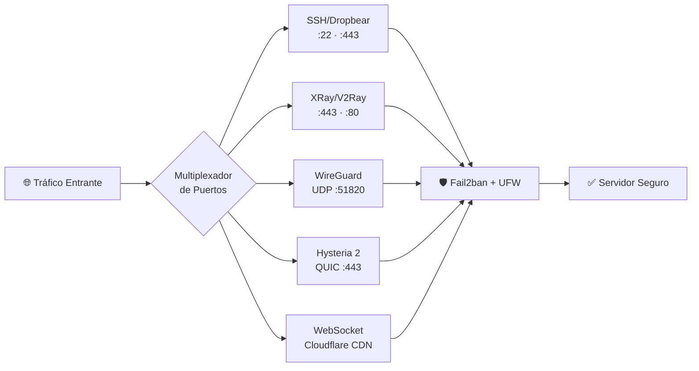

<div align="center">


<br/>
<br/>

# MoviVIP Network Setup™

### Instalador unificado para servidores VPN/VPS
### Automatizado · Firmado · Multi-Protocolo

<br/>

<p>
  
  
  
</p>
<p>
  
  
  
</p>
<p>
    
</p>

<br/>

> **Convierte cualquier VPS limpio en un servidor VPN empresarial operativo en minutos.**
> Instalador único firmado · Payload ejecutado en RAM · Licencia obligatoria

<br/>

[🚀 Instalación](#-instalación-rápida) &nbsp;·&nbsp;
[✅ Qué incluye](#-qué-incluye) &nbsp;·&nbsp;
[🛡️ Protocolos](#-matriz-de-protocolos) &nbsp;·&nbsp;
[🏗️ Arquitectura](#-arquitectura) &nbsp;·&nbsp;
[💎 Planes](#-planes-y-licenciamiento) &nbsp;·&nbsp;
[❓ FAQ](#-faq) &nbsp;·&nbsp;
[📞 Soporte](#-soporte)

</div>

---

## 📖 Tabla de Contenidos

<details>
<summary><b>Ver índice completo</b></summary>
<br/>

- [🎯 ¿Qué es MoviVIP Network Setup?](#-qué-es-movivip-network-setup)
- [⚡ Instalación Rápida](#-instalación-rápida)
- [✅ Qué incluye](#-qué-incluye)
- [🛡️ Matriz de Protocolos (26)](#-matriz-de-protocolos)
- [🏗️ Arquitectura & Seguridad](#-arquitectura)
- [💻 Compatibilidad y Requisitos](#-compatibilidad-y-requisitos)
- [💎 Planes y Licenciamiento](#-planes-y-licenciamiento)
- [🛠️ Post-Instalación & CLI](#-post-instalación--cli)
- [🔍 Verificación de Integridad](#-verificación-de-integridad)
- [❓ FAQ](#-faq)
- [⚖️ Términos Legales](#-términos-legales)
- [📦 Archivos del Repositorio](#-archivos-del-repositorio)
- [📞 Soporte y Comunidad](#-soporte)
- [📄 Licencia](#-licencia)

</details>

---

## 🎯 ¿Qué es MoviVIP Network Setup?

**MoviVIP Network Setup** es una solución de infraestructura de grado empresarial que automatiza por completo la transformación de un VPS limpio *(Ubuntu / Debian)* en un nodo VPN multi-protocolo, securizado y monitoreable desde un panel centralizado.

Un único archivo `.sh` por arquitectura encapsula el ecosistema completo:

```
  setup-{arch}.sh
  ┌──────────────────────────────────────────────────────────────────┐
  │  ┌────────────────────────┐   ┌──────────────────────────────┐  │
  │  │     Go Stub Binary     │   │   Payload Core System (RAM)  │  │
  │  │  ────────────────────  │   │  ──────────────────────────  │  │
  │  │  • Valida Arquitectura │   │  • Scripts de configuración  │  │
  │  │  • Verifica Integridad │   │  • Binarios de protocolos    │  │
  │  │  • Autentica HWID      │   │  • Paneles de gestión        │  │
  │  │  • Gate de Licencia    │   │  • Módulos de seguridad      │  │
  │  └────────────────────────┘   └──────────────────────────────┘  │
  └──────────────────────────────────────────────────────────────────┘
```

| Principio | Descripción |
|:---|:---|
| 🔐 **Zero-Disk Exposure** | Payload ejecutado solo en `tmpfs` RAM — sin residuos en disco |
| 🛡️ **Firma Digital** | Verificación de integridad antes de ejecutar cualquier componente |
| 🔗 **HWID Binding** | Licencia vinculada a hardware — imposible clonar o transferir |
| ⚡ **Multi-Architecture** | Binario nativo para `x86_64` y `ARM64` — rendimiento máximo |
| 🤖 **Fully Automated** | Sin configuración manual — detección y optimización automática |

---

## ⚡ Instalación Rápida

> [!IMPORTANT]
> Requiere usuario **`root`** y acceso a internet. Reemplaza `TU_CLAVE` con tu licencia MoviVIP obtenida en [@MoviVIP](https://t.me/MoviVIP).

### 🚀 Método 1 — One-Liner Auto-Detection *(Recomendado)*

```bash
bash -c "$(wget -qO- https://github.com/studioanime977/MoviVIPNetwork/raw/main/install-auto.sh)" TU_CLAVE
```

> Detecta la arquitectura del servidor, descarga el binario correcto y ejecuta la instalación automáticamente.

---

### 📦 Método 2 — Instalación Manual por Arquitectura

<details>
<summary><b>🖥️ x86_64 — Intel / AMD &nbsp;·&nbsp; DigitalOcean · Vultr · Hetzner · Contabo · AWS EC2</b></summary>
<br/>

```bash
wget https://github.com/studioanime977/MoviVIPNetwork/raw/main/setup-amd64.sh
chmod +x setup-amd64.sh
bash setup-amd64.sh TU_CLAVE
```

</details>

<details>
<summary><b>🦾 ARM64 / aarch64 &nbsp;·&nbsp; Oracle Cloud A1/Flex · AWS Graviton · Google Cloud ARM · Azure ARM</b></summary>
<br/>

```bash
wget https://github.com/studioanime977/MoviVIPNetwork/raw/main/setup-arm64.sh
chmod +x setup-arm64.sh
bash setup-arm64.sh TU_CLAVE
```

</details>

<br/>

> [!TIP]
> ¿No tienes licencia aún? Adquiérela directamente en **[@MoviVIP](https://t.me/MoviVIP)** — Soporte 24/7 en Telegram.

---

## ✅ Qué incluye

<table>
<tr>
<td valign="top" width="50%">

### 🛡️ Protocolos & Túneles
- **26 módulos** entre VPN, proxies y túneles
- OpenSSH, Dropbear SSH, SSL/TLS, WebSocket
- XRay/V2Ray: VMess, VLESS, Reality, XTLS
- WireGuard *(kernel-level)*, OpenVPN
- Hysteria 2 *(QUIC/UDP — anti-censura)*
- SlowDNS, VayDNS, SystemDNS, ZiVPN, DTunnel
- Shadowsocks, SOCKS5, Squid HTTP/HTTPS
- BadVPN UDPGW, UDP Custom, HCR Relay
- SSH-XHTTP, BHTTP v2, BTUN

</td>
<td valign="top" width="50%">

### 🖥️ Paneles & Gestión
- **Bot de Telegram** — creación/gestión de usuarios
- **3X-UI Panel** — interfaz XRay multi-inbound
- **Web MoviVIP** *(FastAPI)* — panel web oficial
- **Webmin** — administración del servidor web
- **CLI nativo** — `menu`, `protocolos`, `usuarios`

### ⚡ Infraestructura & Seguridad
- Balanceador avanzado + multiplexación de puertos
- Optimización TCP: Avanzada
- Fail2ban + Firewall persistente multi-capa
- Snapshots de red, monitoreo por usuario
- Rotación de logs + alertas de expiración
- Cloudflare CDN bypass + VayDNS + SlowDNS

</td>
</tr>
</table>

---

## 🛡️ Matriz de Protocolos

<div align="center">

| # | Protocolo | Tipo | Transporte | Anti-Censura |
|:--:|:---|:---|:---|:---:|
| `01` | **OpenSSH** | Acceso seguro | TCP | — |
| `02` | **Dropbear SSH** | SSH ligero | TCP | — |
| `03` | **SSL/TLS Tunnel** | Túnel seguro | TLS 1.3 | ✅ |
| `04` | **WebSocket (WS)** | HTTP Upgrade | HTTP/1.1 + WS | ✅ CDN |
| `05` | **XRay / V2Ray** | VMess · VLESS · Reality | TCP / gRPC / WS | ✅ |
| `06` | **WireGuard** | VPN moderna | UDP Kernel | — |
| `07` | **OpenVPN** | VPN estándar | TCP + UDP | — |
| `08` | **Shadowsocks** | Proxy seguro | TCP / TLS | ✅ |
| `09` | **Hysteria 2** | Ultra-rápido QUIC | UDP / QUIC | ✅ |
| `10` | **SlowDNS** | DNS Tunnel | UDP 53 | ✅ |
| `11` | **VayDNS / SystemDNS** | DNS personalizado | UDP | ✅ |
| `12` | **ZiVPN** | VPN propietaria | UDP | ✅ |
| `13` | **DTunnel** | Túnel propietario | Binary | ✅ |
| `14` | **BadVPN UDPGW** | UDP Gateway | UDP Multi-port | — |
| `15` | **UDP Custom** | UDP propietario | Binary | ✅ |
| `16` | **SOCKS5** | Proxy estándar | TCP | — |
| `17` | **Squid** | Proxy HTTP/HTTPS | HTTP/CONNECT | — |
| `18` | **SSH-XHTTP** | SSH sobre HTTP | HTTP | ✅ |
| `19` | **BHTTP v2** | HTTP binario | Binary HTTP | ✅ |
| `20` | **BTUN** | Túnel binario | Binary | ✅ |
| `21` | **HCR Relay** | Relay propietario | TCP | ✅ |
| `22` | **Payload Module** | Módulo propietario | — | — |
| `23` | **Bot Telegram** | Automatización | HTTPS API | — |
| `24` | **3X-UI Panel** | Panel XRay | HTTP/HTTPS | — |
| `25` | **Web MoviVIP** | Panel oficial | HTTP/FastAPI | — |
| `26` | **Webmin** | Admin servidor | HTTPS | — |

</div>

> **26 módulos totales**: protocolos de red, paneles de gestión y utilidades de sistema.

---

## 🏗️ Arquitectura

```
╔══════════════════════════════════════════════════════════════════════════╗
║            MOVIVIP NETWORK — FLOW DE INSTALACIÓN & SEGURIDAD            ║
╠══════════════════════════════════════════════════════════════════════════╣
║                                                                          ║
║   [ USUARIO ]  ──►  bash setup-<arch>.sh  YOUR_LICENSE_KEY              ║
║                                   │                                      ║
║                                   ▼                                      ║
║              ┌────────────────────────────────────┐                      ║
║              │          Go Stub Binary            │                      ║
║              │  ┌──────────────────────────────┐  │                      ║
║              │  │  1. Valida Arquitectura       │  │                      ║
║              │  │  2. Verifica Integridad       │  │ ◄── Firma oficial    ║
║              │  │  3. Autentica HWID            │  │ ◄── Hardware ID      ║
║              │  │  4. Valida Licencia           │  │ ◄── Tu clave         ║
║              │  └──────────────────────────────┘  │                      ║
║              └──────────────────┬─────────────────┘                      ║
║                                 │ ✅ Verificación OK                     ║
║                                 ▼                                        ║
║              ┌────────────────────────────────────┐                      ║
║              │        Extracción Protegida        │                      ║
║              │   Payload → memoria RAM (tmpfs)    │ ◄── Zero disk write  ║
║              └──────────────────┬─────────────────┘                      ║
║                                 │                                        ║
║         ┌───────────────────────┼────────────────────┐                   ║
║         ▼                       ▼                    ▼                   ║
║  ┌──────────────┐    ┌───────────────────┐   ┌──────────────────┐       ║
║  │ 26 Protocol  │    │   Mgmt Suite      │   │  Kernel & Net    │       ║
║  │   Modules    │    │  Bot · 3X-UI      │   │  Optimización    │       ║
║  │ VPN·Proxy·WS │    │  WebPanel · Webmin│   │  Fail2ban · UFW  │       ║
║  └──────────────┘    └───────────────────┘   └──────────────────┘       ║
║                                 │                                        ║
║                                 ▼                                        ║
║              ┌────────────────────────────────────┐                      ║
║              │     🗑️  Purga automática tmpfs      │ ◄── Cero residuos   ║
║              └────────────────────────────────────┘                      ║
╚══════════════════════════════════════════════════════════════════════════╝
```

### 🔐 Routing de Tráfico



---

## 💻 Compatibilidad y Requisitos

### 🖥️ Sistemas Operativos

| Distribución | Versiones Soportadas | Estado |
|:---|:---|:---:|
| **Ubuntu** | `20.04 LTS` · `22.04 LTS` · `24.04 LTS` | ✅ Certificado |
| **Debian** | `11 Bullseye` · `12 Bookworm` | ✅ Certificado |
| **CentOS / RHEL** | Cualquier versión | ❌ No soportado |
| **OpenVZ / LXC** | Cualquier versión | ❌ No soportado |
| **ARMv7 / i386** | Cualquier versión | ❌ No soportado |

### ⚙️ Especificaciones de Hardware

| Parámetro | Mínimo | Recomendado |
|:---|:---|:---|
| **CPU** | 1 vCPU x86_64 ó ARM64 | 2+ vCPU ARM64 Ampere / AMD EPYC |
| **RAM** | 512 MB | 1 – 2 GB |
| **Disco** | 5 GB SSD | 15+ GB NVMe |
| **Virtualización** | KVM | KVM |
| **Acceso** | `root` | `root` |
| **Red** | Salida a internet | Salida a internet |

### ☁️ Cloud Providers Certificados

<div align="center">

| Provider | Arquitectura | Estado |
|:---|:---:|:---:|
| **Oracle Cloud** *(A1 · Flex)* | ARM64 | ✅ Certificado |
| **AWS Graviton** *(EC2)* | ARM64 | ✅ Certificado |
| **Google Cloud** *(GCE)* | ARM64 · x86_64 | ✅ Certificado |
| **Microsoft Azure** | ARM64 · x86_64 | ✅ Certificado |
| **DigitalOcean** | x86_64 KVM | ✅ Certificado |
| **Hetzner Cloud** | x86_64 KVM | ✅ Certificado |
| **Vultr** | x86_64 KVM | ✅ Certificado |
| **Contabo** | x86_64 KVM | ✅ Certificado |

</div>

---

## 💎 Planes y Licenciamiento

<div align="center">

| Módulo / Característica | 🥉 Bronze · Standard | 🥈 Premium + | 🥇 Provider · Admin |
|:---|:---:|:---:|:---:|
| OpenSSH · Dropbear · SSL/TLS | ✅ | ✅ | ✅ |
| BadVPN · UDP Custom · SlowDNS | ✅ | ✅ | ✅ |
| WebSocket + Cloudflare CDN | ✅ | ✅ | ✅ |
| VayDNS · ZiVPN · DTunnel | ✅ | ✅ | ✅ |
| Gestor de Usuarios CLI | ✅ | ✅ | ✅ |
| **Bot Telegram Automatizado** | ❌ | ✅ | ✅ |
| **Panel Webmin** | ❌ | ✅ | ✅ |
| **XRay · VMess · VLESS · Reality** | ❌ | ✅ | ✅ |
| **Hysteria 2 · WireGuard · OpenVPN** | ❌ | ✅ | ✅ |
| **3X-UI Panel (XTLS / Reality)** | ❌ | ❌ | ✅ |
| **Web MoviVIP (FastAPI)** | ❌ | ❌ | ✅ |
| **Optimización Kernel** | ❌ | ❌ | ✅ |
| **Firewall Avanzado · Anti-DDoS** | ❌ | ❌ | ✅ |
| **Módulo Facturación · Revendedores** | ❌ | ❌ | ✅ |
| **Shadowsocks · SOCKS5 · Squid** | ❌ | ❌ | ✅ |
| **HCR Relay · BHTTP v2 · BTUN** | ❌ | ❌ | ✅ |
| Soporte técnico | Estándar | Prioritario | **Dedicado 1-a-1** |

</div>

> [!NOTE]
> La licencia se valida **vía hardware (HWID)** antes de iniciar cualquier instalación.
> No existen claves en texto plano ni archivos de licencia editables localmente.

**➡️ Adquiere tu licencia:** **[@MoviVIP](https://t.me/MoviVIP)** — disponibilidad 24/7

---

## 🛠️ Post-Instalación & CLI

Tras completar la instalación, el sistema registra comandos nativos en tu entorno de shell:

```bash
menu       # Panel de control principal
```

```
╔════════════════════════════════════════════════════════════╗
║          MOVIVIP NETWORK MANAGER  ·  v3.0  ™              ║
║           © 2024-2025 MoviVIP Network                     ║
╠════════════════════════════════════════════════════════════╣
║  [1]  Gestión de Protocolos VPN                           ║
║  [2]  Gestión de Usuarios & Cuentas                       ║
║  [3]  Bot de Telegram & Alertas                           ║
║  [4]  Panel Web & Certificados SSL Let's Encrypt          ║
║  [5]  Optimización de Red & Kernel                        ║
║  [6]  Diagnóstico · Logs en Vivo · Test de Velocidad      ║
║  [7]  Backup & Restauración del Servidor                  ║
║  [8]  Actualizar Sistema                                  ║
║  [0]  Salir                                               ║
╚════════════════════════════════════════════════════════════╝
```

| Comando | Descripción |
|:---|:---|
| `menu` | Panel principal interactivo |
| `protocolos` | Gestión de daemons, puertos y certificados por protocolo |
| `usuarios` | Crear · listar · renovar · revocar cuentas VPN |
| `herramientas` | Test de velocidad · auditoría de puertos · estado Fail2ban |

---

## 🔍 Verificación de Integridad

Antes de ejecutar cualquier instalador, verifica que proviene del repositorio oficial:

```bash
# 1. Clonar el repositorio oficial
git clone https://github.com/studioanime977/MoviVIPNetwork
cd MoviVIPNetwork

# 2. Verificar firma del commit — debe terminar en "G" (GPG verified)
git log -1 --format="%an <%ae> %G?"
# ✅ Esperado: MoviVIP Network <vipnetworkmovi@gmail.com> G

# 3. Verificar hash SHA-256 del instalador
sha256sum setup-amd64.sh   # Para x86_64
sha256sum setup-arm64.sh   # Para ARM64
# Compara con los hashes publicados en https://t.me/MoviVIPNetwork
```

> [!CAUTION]
> Si `git log` **no muestra `G`** al final, el commit **no está firmado por MoviVIP Network**.
> **No ejecutes ese instalador.** Descárgalo únicamente desde el [repositorio oficial](https://github.com/studioanime977/MoviVIPNetwork).

---

## ❓ FAQ

<details>
<summary><b>💳 ¿Puedo mover mi licencia a otro servidor?</b></summary>
<br/>

Las licencias están vinculadas al HWID del servidor activo. Para migraciones autorizadas, contacta al [Soporte Oficial](https://t.me/MoviVIP) — el equipo realiza el desvinculado y re-binding de forma manual y verificada.

</details>

<details>
<summary><b>🔌 ¿El instalador modifica o interrumpe mi sesión SSH activa?</b></summary>
<br/>

No. El instalador preserva tu puerto SSH actual y añade puertos de multiplexación adicionales (443, 80, 8080) **sin interrumpir tu sesión remota activa**.

</details>

<details>
<summary><b>🔄 ¿Cómo se actualizan los protocolos y parches de seguridad?</b></summary>
<br/>

El sistema integra una sincronización automática de firmas y binarios cada **48 horas**. Para forzar una actualización manual: `menu → [8] Actualizar Sistema`.

</details>

<details>
<summary><b>⏱️ ¿Cuánto tiempo tarda la instalación completa?</b></summary>
<br/>

Dependiendo de la velocidad de red del VPS y el plan seleccionado, la instalación típica lleva entre **3 y 8 minutos**.

</details>

<details>
<summary><b>🛡️ ¿Cómo sé que el instalador no tiene backdoors?</b></summary>
<br/>

Cada instalador está firmado digitalmente por MoviVIP Network. El stub Go verifica esta firma **antes** de descomprimir cualquier componente. El payload se ejecuta solo en RAM (`tmpfs`) y se purga automáticamente al finalizar — sin escritura en disco. Puedes verificar la firma del commit con `git log` tal como se indica en la sección de [Verificación de Integridad](#-verificación-de-integridad).

</details>

<details>
<summary><b>🌍 ¿Bypasea restricciones ISP / DPI?</b></summary>
<br/>

MoviVIP incluye protocolos anti-censura específicos: **Hysteria 2**, **SlowDNS**, **ZiVPN**, **WebSocket+CDN** y **DTunnel**, diseñados para entornos con inspección profunda de paquetes (DPI) y restricciones ISP. La efectividad puede variar según el país y el operador.

</details>

---

## ⚖️ Términos Legales

### 📜 Copyright y Propiedad Intelectual

<div align="center">

```
╔══════════════════════════════════════════════════════════╗
║         © 2024–2025 MoviVIP Network                     ║
║              Todos los derechos reservados              ║
║                                                         ║
║   Software propietario — Licencia requerida para uso    ║
╚══════════════════════════════════════════════════════════╝
```

</div>

El código fuente, binarios, protocolos propietarios y la marca **MoviVIP** son propiedad exclusiva de **MoviVIP Network**.

**Está estrictamente prohibido:**

| ❌ Prohibición | Alcance |
|:---|:---|
| Ingeniería inversa / descompilación | Binarios, stub, validadores |
| Distribución no autorizada | Forks, mirrors, re-uploads, canales no oficiales |
| Reventa / compartición de licencias | Cualquier medio o canal |
| Modificación de binarios o bypass de firma | Cualquier componente del instalador |
| Desarrollo de productos competidores | Basados total o parcialmente en este software |
| Filtración de claves o licencias | Cualquier canal público o privado |

### 🛡️ Repositorio Oficial

| Estado | URL |
|:---:|:---|
| ✅ **OFICIAL** | `https://github.com/studioanime977/MoviVIPNetwork` |
| ❌ **NO AUTORIZADO** | Cualquier fork, mirror, re-upload o repositorio derivado |

Distribución fuera del repo oficial **será perseguida legalmente (DMCA, derechos de autor, secreto comercial).**

### ⚠️ Tabla de Penalizaciones

| Infracción | Consecuencia Inmediata | Acción Legal |
|:---|:---|:---|
| Distribución no autorizada | Revocación permanente de todas las licencias | DMCA · Secreto Comercial |
| Ingeniería inversa / bypass | Bloqueo permanente HWID + clave | DMCA 1201 · Secretos Comerciales |
| Reventa / compartición | Revocación + lista negra + indemnización | Daños y perjuicios |
| Distribución en forks / mirrors | Revocación + bloqueo inmediato | DMCA Takedown + honorarios |
| Uso en actividades ilegales | Terminación inmediata | Reporte a autoridades |

### 📋 Términos de Uso — Resumen

1. **Licencia personal e intransferible** — Vinculada a tu identidad y hardware del servidor
2. **Una licencia = una instancia activa** — Instalaciones concurrentes revocan la licencia automáticamente
3. **Actualizaciones obligatorias** — Auto-actualización cada 48h no puede desactivarse sin perder soporte
4. **Sin garantía implícita** — Software provisto "TAL CUAL"
5. **Cumplimiento legal** — Eres responsable de cumplir las leyes locales sobre VPN

### 🔒 Adquisición de Licencia Oficial

> [!WARNING]
> **No adquieras licencias a través de revendedores, bots, canales no oficiales de Telegram, Discord, foros o marketplaces.**
> Las licencias de terceros **no activan el software**, no tienen soporte y **serán revocadas sin reembolso**.

| Canal | Descripción | Enlace |
|:---|:---|:---|
| 🛡️ **Telegram Soporte** | Adquisición oficial 24/7 | [t.me/MoviVIP](https://t.me/MoviVIP) |
| ✉️ **Email Corporativo** | Consultas y facturación | [vipnetworkmovi@gmail.com](mailto:vipnetworkmovi@gmail.com) |
| 🌐 **Sitio Web Oficial** | Portal de información | [movivip-network.web.app](https://movivip-network.web.app/) |

---

## 📦 Archivos del Repositorio

| Archivo | Arquitectura | Tamaño | Descripción |
|:---|:---:|:---:|:---|
| `setup-amd64.sh` | x86_64 | ~22.9 MB | Instalador completo para Intel / AMD |
| `setup-arm64.sh` | ARM64 | ~22.5 MB | Instalador completo para ARM64 / aarch64 |
| `install-auto.sh` | Universal | ~2 KB | Auto-detector de arquitectura + launcher |
| `VERSION` | — | — | Versión actual del instalador |
| `assets/logo.png` | — | — | Logo oficial MoviVIP Network |

---

## 📞 Soporte

<div align="center">

| Canal | Descripción | Enlace |
|:---|:---|:---:|
| 🛡️ **Soporte Oficial** | Licencias · Soporte técnico · Migración HWID | [**@MoviVIP**](https://t.me/MoviVIP) |
| 📢 **Canal Principal** | Releases · Hashes SHA256 · Anuncios | [**@MoviVIPNetwork**](https://t.me/MoviVIPNetwork) |
| 👥 **Grupo Comunitario** | Comunidad de administradores y usuarios | [**@MoviVIPNet**](https://t.me/MoviVIPNet) |
| 🌐 **Sitio Web** | Portal oficial MoviVIP Network | [movivip-network.web.app](https://movivip-network.web.app/) |
| ✉️ **Email** | Consultas corporativas y facturación | [vipnetworkmovi@gmail.com](mailto:vipnetworkmovi@gmail.com) |

<br/>

### 🤝 Comunidad Aliada

[📢 Canal FreeNetZone](https://t.me/FreeNetZonevip) &nbsp;·&nbsp; [👥 Grupo FreeNetZone](https://t.me/FreeNetZonevips) &nbsp;·&nbsp; [📢 Canal TunnelCol](https://t.me/TunnelCol)

</div>

---

## 📄 Licencia

La **documentación pública** de este repositorio *(README, scripts de ejemplo, configuraciones de referencia)* se distribuye bajo **CC0-1.0 — Dominio Público**.

```
CC0 1.0 Universal — Public Domain Dedication
https://creativecommons.org/publicdomain/zero/1.0/
```

> **⚠️ Importante**: CC0-1.0 aplica **únicamente** a los archivos de documentación de este repositorio público.
> El **software propietario MoviVIP Network Setup** *(binarios, payloads, validadores)*
> **NO está cubierto por CC0** y permanece como software propietario con todos los derechos reservados.

---

<div align="center">

<br/>


<br/>

**MoviVIP Network** — *Tu Mundo Digital en Buenas Manos*

```
© 2024–2025 MoviVIP Network · Todos los derechos reservados
VPS · Servers · VPN · Ingeniería de Sistemas
```

Soporte 24/7: [**@MoviVIP**](https://t.me/MoviVIP) · Canal oficial: [**@MoviVIPNetwork**](https://t.me/MoviVIPNetwork)

*Si este proyecto te fue útil, considera dejar una ⭐ en el repositorio.*

</div>
